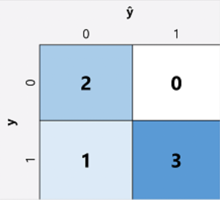

# Common AI Workloads

### Computer Vision

Computer Vision is a key AI workload, primarily concerned with enabling computers to interpret and analyze visual data. This can include tasks like image classification, where the system recognizes and categorizes objects within images. Object detection focuses on identifying and locating multiple objects in visual data, while face recognition enables the identification of individuals based on their facial features. OCR (Optical Character Recognition) allows for extracting text from images, and image analysis provides insights like detecting emotions or understanding the content of scenes.

### Natrual Language Processing

Natural Language Processing (NLP) focuses on enabling machines to understand and process human language. In text classification, the goal is to categorize text into specific categories, which could be used for sentiment analysis, topic modeling, or spam detection. NLP also includes language translation, helping systems automatically translate text from one language to another. Speech recognition converts spoken language into text, and text-to-speech (TTS) synthesizes natural-sounding speech from text input, enabling more interactive and accessible systems.

### Anamoly Detection

Anomaly detection in AI involves identifying patterns that deviate from the expected, often applied to areas like fraud detection, cybersecurity, and health monitoring. This workload relies on identifying outliers in datasets and flagging them for further analysis.

### Predictive Analytics

Predictive Analytics is another important workload that uses historical data to predict future trends. By applying machine learning models, businesses can forecast demand, anticipate equipment failures, and plan more effectively. This workload typically involves time-series forecasting, regression analysis, and pattern recognition.

### Content Moderation

It is used to find adult, hateful, offensive, violent, and other harmful contents and prevent them from being uploaded. We can set the severity level to allow some free speech.

# Guiding Principles Of AI Development

### Fairness

AI Systems should treat everyone equally and avoid affecting similarly situated groups of people in different ways

### Reliability and Safety

It is critical that AI systems operate reliabily, safely, and consistently under normal circumstances and in unexpected conditions

### Privacy and security

AI systems should be secure and respect privacy. The machine learning models on which AI systems are based rely on large volumes of data, which may contain personal details that must be kept private. Even after the models are trained and the system is in production, privacy and security need to be considered. As the system uses new data to make predictions or take action, both the data and decisions made from the data may be subject to privacy or security concerns.

### Inclusiveness

AI systems should empower everyone. AI should bring benefits to all parts of society, regardless of physical ability, gender, sexual orientation, ethnicity, or other factors.

### Transparency

AI systems should be understandable. Users should be made fully aware of the purpose of the system, how it works, and what limitations may be expected.

### Accountability

People should be accountable for AI systems. Designers and developers of AI-based solutions should work within a framework of governance and organizational principles that ensure the solution meets ethical and legal standards that are clearly defined.

# AI In Azure

Azure AI services – a portfolio of AI services that can be incorporated into applications quickly and easily without specialist knowledge. Azure AI services is also the name for the multi-service resource created in the Azure portal that provides access to several different Azure AI services with a single key and endpoint. By endpoint we mean the location of a resource, such as an Azure AI service. We have 2 types of resources based on our needs and billing.

1. Multi-service resource – the AI service resource created in the Azure portal that provides access to a bundle of AI services.
2. Single-service resource – a resource created in the Azure portal that provides access to a single Azure AI service, such as Speech, Vision, Language, etc. Each Azure AI service has a unique key and endpoint.

# Common Machine Learning Types

## Regression

It is a type of supervised learning method. The ability to predict outcome variables give 1 or more inputs. In this type the result is numeric(price,amount,size).
It is generally finding relations between variables.

## Classification

It is a type of supervised learning method. The goal is to predict a discrete label or category for a given input based on its features. The task is to map input data to one of several predefined classes.

### Binary Classification

Binary classification algorithms are used to train a model that predicts one of two possible labels for a single class. Essentially, predicting true or false. In most real scenarios, the data observations used to train and validate the model consist of multiple feature (x) values and a y value that is either 1 or 0.

#### Performance Measure

The first step in calculating evaluation metrics for a binary classification model is usually to create a matrix of the number of correct and incorrect predictions for each possible class label
ŷ=0 and y=0: True negatives (Model correctly predicts negative when actual is negative.)
ŷ=1 and y=0: False positives (Model incorrectly predicts positive when actual is negative.)
ŷ=0 and y=1: False negatives (Model incorrectly predicts negative when actual is positive.)
ŷ=1 and y=1: True positives (Model incorrectly predicts negative when actual is positive.)

##### Accuracy

The simplest metric you can calculate from the confusion matrix is accuracy - the proportion of predictions that the model got right. Accuracy is calculated as:

(TN+TP) ÷ (TN+FN+FP+TP)

##### Recall

Recall is a metric that measures the proportion of positive cases that the model identified correctly. In other words, compared to the number of patients who have diabetes, how many did the model predict to have diabetes?

The formula for recall is:

TP ÷ (TP+FN)

##### Precision

Precision is a similar metric to recall, but measures the proportion of predicted positive cases where the true label is actually positive. In other words, what proportion of the patients predicted by the model to have diabetes actually have diabetes?
The formula for precision is:

TP ÷ (TP+FP)

### Multiclass classification

Multiclass classification is used to predict to which of multiple possible classes an observation belongs. As a supervised machine learning technique, it follows the same iterative train, validate, and evaluate process as regression and binary classification in which a subset of the training data is held back to validate the trained model.

## Clustering

This is a type of unsupervised learning methods. In this we donot have any kinds of labelled data. The model is trained to find underlying relations between the input items and group them into clusters based on these relations.

# Deep Learning

Deep learning is a sub set of machine learning in which neural networks with layered structures are used for decision making. In these we mainly used large amounts of data. This is how an ML algorithm can perform complex tasks such as image recognition, speech processing etc. It does so by using a hierarchy of neural networks, each iteration getting more complex and understanding the problem at deeper level.

# Core Machine Learning Concepts

## Training The Model

Generally we donot use all the data for training, but we split the data into 2 groups i.e training data and validation/test data.
It is recommended to split the data randomly i.e all the key elements are equally distributed in both datasets.  
After traning the ML algorithm on test data we must validate the testing using the test data and see how close/far are the outputs to the expected outputs. We can do this by using some mathematical calculations like Mean Square Methods in this we take the difference between the predicted output and actual output we determine the accuracy of the ML algorithm.

# Computer Vision

Computer vision is one of the core areas of artificial intelligence (AI), and focuses on creating solutions that enable AI applications to "see" the world and make sense of it.

## Image Processing

To a computer, an image is an array of numeric pixel values.The ability to use filters to apply effects to images is useful in image processing tasks, such as you might perform with image editing software.

### Convolutional neural networks (CNNs)

One of the most common machine learning model architectures for computer vision is a convolutional neural network (CNN), a type of deep learning architecture. CNNs use filters to extract numeric feature maps from images, and then feed the feature values into a deep learning model to generate a label prediction.
During the training process for a CNN, filter kernels(Filter kernels are small, trainable matrices that slide over the input image or over the output of the previous layer during the convolution operationEach kernel extracts a specific kind of feature from the input, such as edges, corners, textures, or more abstract patterns deeper in the network) are initially defined using randomly generated weight values. Then, as the training process progresses, the models predictions are evaluated against known label values, and the filter weights are adjusted to improve accuracy.

# Azure Machine Learning

Azure machine learning is a cloud based service that helps simplify some of the tasks and reduce the time it takes to prepare data, train the model
and deploy a predictive service

## Auto ML

AutoML is a cloud-based service that automates the machine learning process, allowing users to build, train, and deploy models without coding expertise.
It streamlines tasks like data preprocessing, model selection, hyperparameter tuning, and evaluation. AutoML automatically chooses the best algorithm, optimizes parameters, and generates performance metrics. It supports tasks such as classification, regression, and time series forecasting.
AutoML enables users to quickly integrate machine learning models into applications, making it accessible for non-technical users while still offering customization for advanced users.

## Azure ML Designer

Azure Machine Learning Designer is a drag-and-drop interface within the Azure Machine Learning service that allows users to build, train, and deploy machine learning models without writing code. It provides a visual environment where users can create end-to-end machine learning pipelines by connecting various pre-built
components like data inputs, data transformations, models, and evaluation metrics.

# Computer Vision

One of the primary applications of computer vision in Azure is image classification, where the system is fed images and classifies them into predefined categories. Another widely used application is object detection, which allows the identification and classification of multiple objects within an image.
Semantic segmentation is another important application of computer vision, where the system classifies each pixel in an image into a specific category or label. Unlike object detection, which focuses on identifying and classifying objects, semantic segmentation provides a more detailed understanding by segmenting the entire image into regions that correspond to different classes, such as roads, buildings, or trees. This technique is especially useful in tasks like autonomous driving and medical image analysis.
Optical Character Recognition (OCR) is a key application of computer vision that enables the extraction of text from images or scanned documents. OCR analyzes the structure of the document, detects characters, and converts them into machine-readable text.

### Azure AI Video Indexer

Azure AI Video Indexer is a cloud-based service provided by Microsoft Azure that uses artificial intelligence (AI) and machine learning (ML) to extract rich, actionable insights from video and audio content.

# Natural Language Processing

Natural Language Processing (NLP) is a branch of artificial intelligence that focuses on enabling computers to understand, interpret, and generate human language. It involves tasks like speech recognition, text analysis, sentiment analysis, machine translation, and chatbot creation, helping bridge communication between humans and machines.

## Common NLP Workloads

### Key Phrase Extraction

The main purpose of this is to identify and extract the important infomartion from documents. This is generally used to decide the context of the text provided.

### Entity Recognition

Identifies entities of a document that can be categorized into types and sub types.  
Eg:- "My car and bike are in the garage earlier today". The entites that maybe found are:-  
Car, Bike - Objects  
Garage - Location  
Earlier Today - Date

### Sentiment Analysis

This is a prebuilt ML model used to identify the overall sentiment of the provided text. It provides a score between 0 to 1, generally higher the score the more positve the sentiment.

## NLP in Azure

Azure provides several tools and services for Natural Language Processing (NLP), offering a wide range of capabilities for text analysis, language understanding, sentiment analysis, translation, and more.

### Text Analytics

The Text Analytics service in Azure Cognitive Services provides a range of NLP capabilities, including:  
 Sentiment Analysis: Analyzes text to determine if the sentiment is positive, negative, or neutral. It can also assess the intensity of sentiment in the text.  
 Key Phrase Extraction: Identifies important phrases in the text that represent the main topics or concepts.  
 Language Detection: Automatically detects the language of the input text, useful when working with multilingual content.  
 Named Entity Recognition (NER): Identifies entities in text, such as people, organizations, locations, dates, and more.

### Language Understanding (LUIS)

Language Understanding (LUIS) helps developers create natural language models that understand user intents and entities in conversational apps (e.g., chatbots, virtual assistants). LUIS is great for building custom language models.

### Translator

Azure's Translator service is an NLP solution that supports real-time text translation between over 70 languages.  
Text Translation: Translate text between various languages.  
Transliteration: Convert text from one writing system to another (e.g., from Latin script to Cyrillic).  
Language Detection: Automatically detects the language of the input text.

### Speech-to-Text and Text-to-Speech

These services convert spoken language into text and vice versa. They are often used for voice-based applications, transcription, and real-time speech translation.  
Speech-to-Text: Converts audio files or real-time spoken language into text.  
Text-to-Speech: Converts text into spoken language using natural-sounding voices.  
Speaker Recognition: Identifies different speakers in an audio stream.
